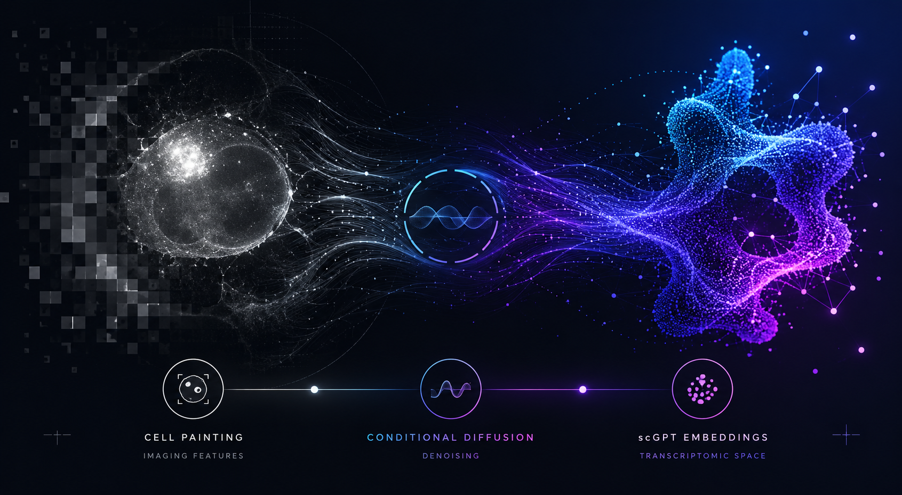

<div align="center">

# PhenoSeq

### Generating single-cell transcriptomic embeddings from Cell Painting morphology using conditional diffusion

<p align="center">
  
</p>

[]()
[]()
[]()
[]()

</div>

---

## Overview

**PhenoSeq** is a conditional diffusion model that generates biologically structured **scRNA-seq embeddings** directly from **Cell Painting microscopy images**.

Rather than treating morphology and transcriptomics as independent measurements, PhenoSeq learns a shared latent relationship between the two modalities. Given only imaging-derived features, the model synthesises transcriptomic representations in the pretrained **scGPT embedding space**, enabling downstream molecular analysis without sequencing.

<p align="center">
  
</p>

### Key Idea

Cell morphology is a physical manifestation of underlying molecular state.

PhenoSeq learns to translate:

```text
Cell Painting Morphology
            ↓
     Conditional Diffusion
            ↓
   Synthetic scGPT Embeddings
            ↓
Transcriptomic Representation
```

---

## Highlights

- First diffusion model for generating transcriptomic embeddings from Cell Painting morphology
- Cross-attention transformer architecture
- Population-level supervision (no cell-paired data required)
- Generates biologically structured scGPT embeddings
- Improves treatment classification over imaging alone
- Recovers ~29% of the gap to the real-transcriptomics multimodal ceiling

---

## Results

### Treatment Classification (Single Profile)

| Modality | WE Balanced Accuracy |
|-----------|-----------|
| Imaging | 0.270 |
| Synthetic RNA | 0.293 |
| Imaging + Synthetic RNA | 0.315 |
| Imaging + Real RNA | 0.425 |

Synthetic transcriptomic embeddings consistently outperform morphology alone and provide complementary biological signal when fused with imaging.

---

## Method

PhenoSeq consists of three components:

### 1. Imaging Encoder

Cell Painting images are encoded using a frozen ViT-L backbone:

```text
5 channels × 1024 features
          ↓
      5120-d vector
```

### 2. Conditional Diffusion

A transformer-based denoiser predicts noise in scGPT latent space while attending to imaging-derived context.

```text
Noisy RNA Embedding
          ↓
 Cross-Attention Transformer
          ↓
 Predicted Noise
```

### 3. Transcriptomic Generation

Iterative denoising produces a synthetic transcriptomic embedding:

```text
xT ~ N(0,I)
      ↓
 DDIM Sampling
      ↓
Synthetic scGPT Embedding
```

---

## Architecture

```text
Cell Painting Features (5120)
            │
            ▼
     Self-Attention Encoder
            │
            ▼
      Cross-Attention
            │
            ▼
   Diffusion Transformer
            │
            ▼
 Synthetic scGPT (512)
```

Key parameters:

| Parameter | Value |
|------------|---------|
| Diffusion Steps | 1000 |
| Transformer Layers | 6 |
| Heads | 8 |
| Model Dimension | 1024 |
| RNA Dimension | 512 |
| Imaging Dimension | 5120 |

---

## Dataset

We train and evaluate on the **scGeneScope** dataset.

### Modalities

#### Cell Painting

- 5 fluorescence channels
- ViT-L ImageNet embeddings
- 5120-dimensional representation

#### Single-cell RNA-seq

- scGPT embeddings
- 512-dimensional representation

Dataset:

```text
scGeneScope
├── Imaging
│   └── ViT-L embeddings
└── RNA-seq
    └── scGPT embeddings
```

---

## Installation

```bash
git clone https://github.com/<username>/PhenoSeq.git
cd PhenoSeq

pip install -r requirements.txt
```

---

## Training

```bash
python train.py --config config.yaml
```

Example:

```bash
python train.py \
    --config config.yaml \
    --batch_size 256 \
    --lr 1e-4 \
    --diffusion_steps 1000 \
    --model_dim 1024
```

---

## Project Structure

```text
img2rna/
├── train.py
├── config.yaml
├── requirements.txt
│
├── models/
│   ├── diffusion.py
│   ├── denoiser.py
│   └── model_utils.py
│
├── data/
│   └── dataset.py
│
├── utils/
│   └── train_utils.py
│
└── assets/
    ├── phenoseq_hero.png
    └── architecture.png
```

